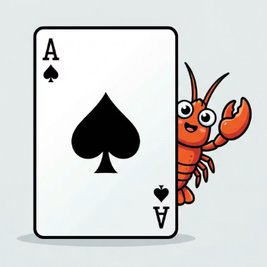

<p align="center">
  
</p>

<h1 align="center">AceClaw</h1>

<p align="center">Enterprise-grade, general-purpose autonomous AI agent built on Java 21.</p>

AceClaw is the Java implementation of [OpenClaw](https://github.com/openclaw) — built for enterprise environments where security, self-improvement, and extensibility matter.

## AceClaw vs OpenClaw

| Capability | OpenClaw | AceClaw |
|------------|----------|---------|
| **Language** | TypeScript/Node.js | Java 21 (GraalVM native) |
| **Agent Loop** | External (Pi framework) | Self-implemented ReAct loop |
| **Architecture** | Single process | Daemon-first (persistent JVM + thin CLI) |
| **Concurrency** | Node.js async | Virtual threads (Project Loom) |
| **Memory** | None (no cross-session learning) | 6-tier hierarchy, hybrid search, daily journal, HMAC-signed |
| **Security** | Breached within 48h of launch | Sealed permission model, HMAC integrity, gated tools |
| **LLM Providers** | Pi SDK (multi-provider) | 7 providers (Anthropic, OpenAI, Groq, Together, Mistral, Copilot, Ollama) |
| **Tools** | 50+ via community | 12 built-in + MCP extensibility |
| **Skills** | 700+ community (SKILL.md) | Planned: adaptive skills with effectiveness metrics |
| **Agent Teams** | Not supported | Planned: in-process virtual thread teammates |
| **Type Safety** | TypeScript | Sealed interfaces + exhaustive pattern matching |
| **Startup** | ~500ms (Node.js) | Sub-50ms (GraalVM native image) |

## Quick Start

```bash
# Build
./gradlew clean build && ./gradlew :aceclaw-cli:installDist

# Configure
export ANTHROPIC_API_KEY="sk-ant-api03-..."

# Run (auto-starts daemon)
./aceclaw-cli/build/install/aceclaw-cli/bin/aceclaw-cli
```

Multi-provider support:
```bash
export ACECLAW_PROVIDER="openai"   # or groq, together, mistral, ollama
export OPENAI_API_KEY="sk-..."
```

## Architecture

```
CLI (Picocli + JLine3)
  │ JSON-RPC 2.0 over Unix Domain Socket
Daemon (persistent JVM)
  ├─ Request Router       → method dispatch
  ├─ Session Manager      → per-project sessions
  ├─ Streaming Agent Loop → ReAct loop (max 25 iterations)
  ├─ Permission Manager   → READ auto-approved, WRITE/EXECUTE gated
  ├─ Tool Registry        → 12 native tools + MCP
  ├─ Memory System        → 6-tier hierarchy, hybrid search, daily journal
  ├─ Context Compactor    → 3-phase (prune → summarize → memory flush)
  └─ LLM Client Factory   → 7 providers, extended thinking, prompt caching
```

### Modules

| Module | Purpose |
|--------|---------|
| `aceclaw-core` | LLM abstractions, agent loop, tool interface, context compaction |
| `aceclaw-llm` | Anthropic + OpenAI-compatible LLM clients |
| `aceclaw-tools` | 12 built-in tools (file ops, bash, glob, grep, web, browser) |
| `aceclaw-security` | Sealed permission model (AutoAllow / PromptOnce / AlwaysAsk / Deny) |
| `aceclaw-memory` | 6-tier memory hierarchy, hybrid search, daily journal, HMAC integrity |
| `aceclaw-mcp` | MCP client integration for external tools |
| `aceclaw-daemon` | Daemon process, UDS listener, streaming handler |
| `aceclaw-cli` | CLI entry point, REPL, daemon lifecycle |

## Memory System

AceClaw implements a 6-tier persistent memory hierarchy — the most structured memory system among open-source coding agents.

### Memory Comparison

| Capability | Claude Code | OpenClaw | AceClaw |
|------------|-------------|----------|---------|
| **Cross-session memory** | MEMORY.md (flat file) | None | HMAC-signed JSONL + daily journal |
| **Memory tiers** | 1 (auto-memory only) | 0 | 6 (Soul → Policy → Workspace → User → Auto → Journal) |
| **Categories** | Unstructured text | N/A | 16 typed categories |
| **Search** | None (full injection) | N/A | Hybrid: TF-IDF + recency decay + frequency boost |
| **Integrity** | None | None | HMAC-SHA256 per entry, constant-time verification |
| **Key protection** | N/A | N/A | POSIX 600 on signing key |
| **Workspace isolation** | Per-project directory | N/A | SHA-256 hashed workspace paths |
| **Activity log** | None | None | Append-only daily journal (500-line cap) |
| **Context compaction** | Summarize-only | None | 3-phase (prune → summarize → memory flush) |
| **Memory in prompt** | Appended at end | N/A | Tiered assembly with priority ordering |

### 6-Tier Hierarchy

```
Priority 100  Soul           ← SOUL.md (immutable core identity)
Priority  90  Managed Policy ← Organization policies (enterprise)
Priority  80  Workspace      ← Project ACECLAW.md instructions
Priority  70  User           ← Global ~/.aceclaw/ACECLAW.md
Priority  60  Auto-Memory    ← Learned insights (16 categories, HMAC-signed)
Priority  50  Daily Journal  ← Append-only activity log (today + yesterday)
```

### 16 Memory Categories

Mistake · Pattern · Preference · Codebase Insight · Strategy · Workflow · Environment · Relationship · Terminology · Constraint · Decision · Tool Usage · Communication · Context · Correction · Bookmark

### Hybrid Search

Memories are ranked by a weighted combination, not just recency:

```
score = 0.50 × TF-IDF relevance
      + 0.35 × recency (7-day half-life exponential decay)
      + 0.15 × tag frequency boost (log(1 + matching tags))
```

## Roadmap

- [x] Daemon-first architecture, streaming ReAct loop, 12 tools
- [x] Extended thinking, retry, prompt caching, context compaction
- [x] Multi-provider (7 providers), HMAC-signed memory, MCP integration
- [x] 6-tier memory hierarchy, hybrid search, daily journal, workspace isolation
- [ ] Self-learning: skill system, self-improvement loop, summary learning
- [ ] Sub-agents: depth-1 delegation, custom agent definitions
- [ ] Agent teams: virtual thread teammates, shared tasks, inter-agent messaging
- [ ] Hook system: PreToolUse/PostToolUse lifecycle events

## Tech Stack

Java 21 (preview features) · Gradle 8.14 · Picocli 4.7.6 · JLine3 3.27.1 · Jackson 2.18.2 · GraalVM Native Image · JUnit 5

## License

TBD
