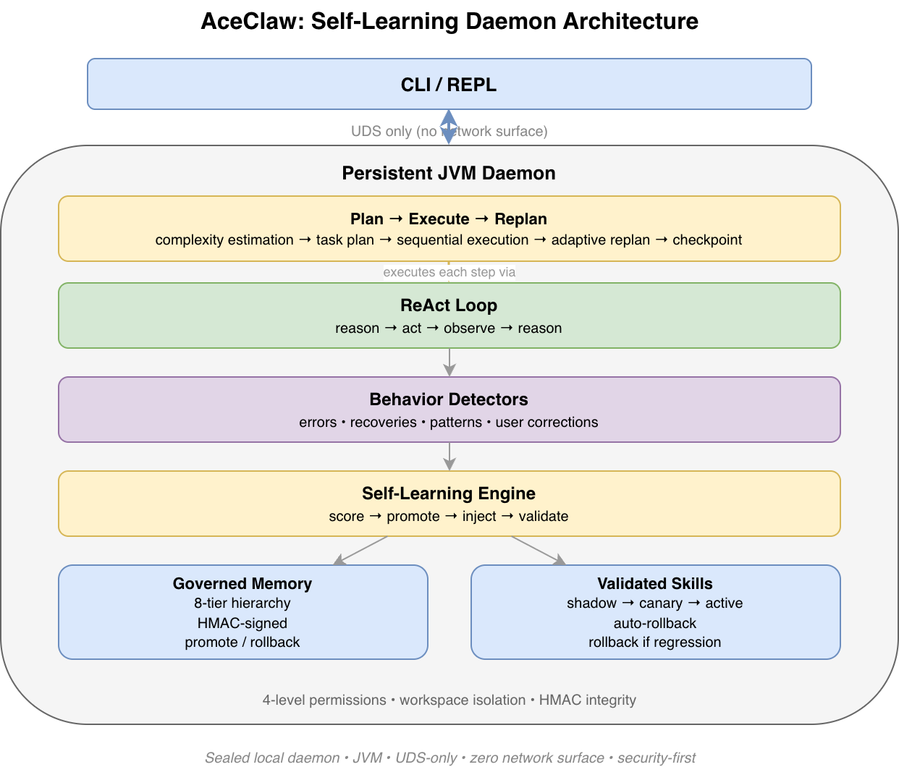
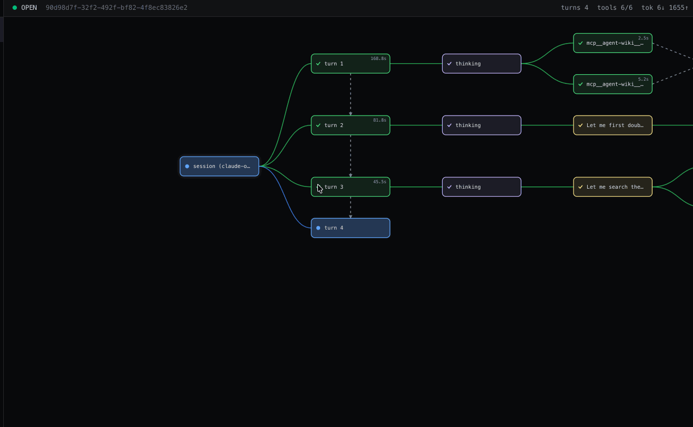

<h1 align="center">AceClaw</h1>

<p align="center">A Java agent runtime with a visual agent harness for long-running work</p>

<p align="center">
  <a href="https://github.com/xinhuagu/AceClaw/actions/workflows/ci.yml"></a>
  
  
  
  
  
</p>

AceClaw is two things in one project:

### 1. A Java agent runtime

A persistent JVM daemon that runs the ReAct + Plan/Replan loop, tools, permissions, memory, and self-learning. Pure Java 21, zero AI framework. The CLI talks to it over a Unix Domain Socket (no network surface).

<p align="center">
  
</p>

> Memory helps an agent remember. Self-learning helps an agent improve. Visualization makes both legible.

**[Read the design philosophy →](docs/design-philosophy.md)** — why Java, why no AI framework, what drives the architecture.

### 2. A visual agent harness

A React dashboard that talks to the same daemon over a loopback-only WebSocket bridge, so you can watch — and intervene in — the agent in real time. The ReAct loop is laid out as a live, navigable tree: every thinking block, tool call, and observation appears as its own node so you can see the agent reason, act, observe, and iterate. Permission requests show up as inline panels you can Approve or Deny from the browser.

<p align="center">
  
</p>

**[Visual Agent Harness →](docs/visual-harness.md)**

## Highlights

- **Visual agent harness** — live execution tree, inline permission Approve/Deny from the browser. *([details](docs/visual-harness.md))*
- **Plan → Execute → Replan** — explicit task plan layered on top of ReAct, with per-step budgets and inline replan on failure. *([details](docs/plan-replan.md))*
- **Self-learning** — zero-cost detectors turn behavior into typed, confidence-scored insights that survive across sessions. *([details](docs/self-learning.md))*
- **Long-term memory** — 8-tier hierarchy, HMAC-signed entries, hybrid search, automated consolidation. *([details](docs/memory-system-design.md))*
- **Context engineering** — budgeted 8-tier prompt assembly, 3-phase compaction, request-time pruning. *([details](docs/context-engineering.md))*
- **Security** — UDS-only daemon socket, sealed 4-level permissions, signed memory, no network attack surface. *([details](docs/security.md))*

## Quick Start

### One-Line Install

```bash
curl -fsSL https://raw.githubusercontent.com/xinhuagu/AceClaw/main/install.sh | sh
```

Downloads the latest pre-built release, extracts to `~/.aceclaw/`, and adds commands to your PATH. Only requires Java 21 runtime (no build tools).

### Configure & Run

```bash
export ANTHROPIC_API_KEY="sk-ant-api03-..."
aceclaw                # Start AceClaw (auto-starts daemon)
```

Or use OAuth (auto-discovered from Claude CLI credentials):
```bash
claude                 # Login via Claude CLI first
aceclaw                # Token auto-refreshes from Keychain
```

### Commands

All commands installed by `install.sh`. Every command that accepts `[provider]` switches the LLM backend for that session.

| Command | What it does |
|---------|-------------|
| `aceclaw` | Start AceClaw TUI (auto-starts daemon if not running) |
| `aceclaw-tui [provider]` | Open another TUI window — never restarts daemon, safe for multi-session |
| `aceclaw-restart [provider]` | Stop daemon + restart with fresh build (warns if sessions active) |
| `aceclaw-update` | Update to latest release (refuses if sessions active) |

**Supported providers:** `anthropic` (default), `copilot`, `openai`, `openai-codex`, `ollama`, `groq`, `together`, `mistral`

#### Daemon Management

The daemon is a persistent JVM process that runs in the background. It auto-starts when you run `aceclaw`, but can be managed directly:

```bash
aceclaw daemon start              # Start daemon in background
aceclaw daemon start -p copilot   # Start background daemon with provider override
aceclaw daemon start --foreground # Start daemon in foreground (for debugging)
aceclaw daemon stop     # Gracefully stop daemon
aceclaw daemon status   # Show health, version, model, active sessions
```

#### Switching Providers

Pass the provider name as an argument to any launch command:

```bash
# Release install (symlinked commands)
aceclaw-restart copilot       # Restart daemon with GitHub Copilot
aceclaw-tui ollama            # Open TUI against local Ollama (no daemon restart)
aceclaw-restart anthropic     # Switch back to Anthropic Claude

# Or via environment variable (works with any command)
ACECLAW_PROVIDER=groq aceclaw
```

#### Provider Authentication

```bash
# Anthropic — API key or OAuth
export ANTHROPIC_API_KEY="sk-ant-api03-..."     # API key in env
# Or add to ~/.aceclaw/config.json: {"apiKey": "sk-ant-api03-..."}
# Or login via Claude CLI for OAuth token auto-refresh

# GitHub Copilot — uses your existing subscription
aceclaw-restart copilot                         # No extra key needed

# OpenAI / OpenAI Codex
export OPENAI_API_KEY="sk-..."
aceclaw-restart openai
# Or OAuth for Codex:
aceclaw models auth login --provider openai-codex
aceclaw-restart openai-codex

# Ollama (local, offline, no key needed)
aceclaw-restart ollama

# Groq / Together / Mistral
export OPENAI_API_KEY="gsk_..."                 # Provider-specific key
aceclaw-restart groq
```

See [Provider Configuration](docs/provider-configuration.md) for full setup details.

### Build from Source (Developers)

```bash
git clone https://github.com/xinhuagu/AceClaw.git && cd AceClaw
./gradlew clean build && ./gradlew :aceclaw-cli:installDist
./aceclaw-cli/build/install/aceclaw-cli/bin/aceclaw-cli
```

Development scripts (from git checkout only — same provider argument support):

| Script | What it does |
|--------|-------------|
| `./dev.sh [provider]` | Rebuild + restart daemon + auto-benchmark on feature branches |
| `./restart.sh [provider]` | Rebuild + restart daemon (no benchmarks, fastest restart) |
| `./tui.sh [provider]` | Open TUI window (no restart, no rebuild if binary exists) |

```bash
./dev.sh                    # Default: anthropic, with benchmarks on feature branches
./dev.sh --no-bench copilot # Copilot, skip benchmarks
./restart.sh ollama         # Quick restart with Ollama
./tui.sh                    # Attach to running daemon
```

See [Multi-Session Model](docs/multi-session.md) for details on running multiple TUI windows.

## Platform Support

| Platform | Status | IPC | CI Gate |
|----------|--------|-----|---------|
| **Linux** | Fully supported | AF_UNIX | `pre-merge-check` — full test suite (required) |
| **macOS** | Fully supported | AF_UNIX | `platform-smoke` — build + cross-platform tests (required) |
| **Windows 10 1803+** | Experimental | AF_UNIX (JEP 380) | `platform-smoke` — build + cross-platform tests (required) |

All three platform checks are required for merging to main. Windows requires Java 21 runtime and Windows 10 version 1803 or later (for AF_UNIX socket support). See [Windows UDS Spike](docs/windows-uds-spike.md) for technical details.

## Tech Stack

**Runtime (daemon + CLI):** Java 21 (preview features) · Gradle 8.14 · Picocli 4.7.6 · JLine3 3.27.1 · Jackson 2.18.2 · Javalin 6 (WebSocket bridge) · GraalVM Native Image · JUnit 5

**Dashboard:** React 19 · TypeScript 5 · Vite 6 · Tailwind 4 · framer-motion · dagre · Vitest

## License

[Apache License 2.0](LICENSE)
