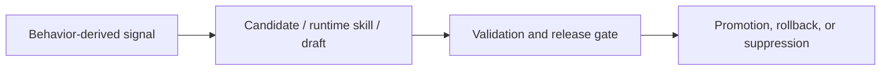

# Continuous-Learning Governance Closure (`#65`)

This document defines the operational governance baseline for continuous-learning rollout:
process controls, safety controls, rollback controls, and status event protocol.

In the current architecture, this governance layer sits *after* the main self-learning loop. It governs what happens once behavior-derived signals start affecting prompts, drafts, and runtime adaptation.

## 1) Process Controls

- Required merge gates for continuous-learning changes:
  - `pre-merge-check` must pass.
  - replay quality gate must pass (strict mode in CI).
- Any change that touches candidate promotion/injection, validation gate, or auto-release logic
  must include:
  - an operations note update (`docs/continuous-learning-operations.md`)
  - at least one regression test for failure-path behavior.
- PRs that change rollout policy must explicitly document:
  - default thresholds
  - runtime override path
  - rollback command path.

## 2) Safety Controls

These controls exist because AceClaw treats learning as a governed runtime system, not as uncontrolled note accumulation.

- Runtime kill switch:
  - disable candidate injection immediately via `candidate.injection.set(enabled=false)`.
- Validation safety:
  - draft promotion requires validation-gate pass and replay report checks.
- Auto-release safety:
  - stage transition is constrained to `shadow -> canary -> active`.
  - guardrail breach forces rollback to `shadow`.
- Visibility safety:
  - CLI status panel surfaces running tasks, timeout/stall suspicion, and permission waits.
  - continuous-learning summary line surfaces replay/candidate/release state from source artifacts.

## 3) Rollback Controls

- Candidate rollback:
  - use runtime command `candidate.rollback`.
- Skill release rollback:
  - use `skill.release.forceRollback`.
- Emergency pause:
  - use `skill.release.pause` to stop progression.
- Post-rollback checklist:
  - capture reason code
  - record incident note
  - verify state files updated:
    - `.aceclaw/metrics/continuous-learning/skill-release-state.json`
    - `.aceclaw/metrics/continuous-learning/skill-release-audit.jsonl`

## 4) Status Event Protocol

Status surfaces are derived from source-of-truth runtime objects/files:

- Task runtime status:
  - source: `TaskHandle` (`state`, `lastActivityAt`, `waitingPermission`, `permissionDetail`)
  - rendered states: `running`, `wait_perm`, `stalled`, `timeout`
- Permission status:
  - source: `PermissionBridge` pending queue
  - rendered fields: `taskId`, `description`, pending count
- Continuous-learning summary:
  - replay source: `.aceclaw/metrics/continuous-learning/replay-latest.json`
  - candidate source: `.aceclaw/memory/candidates.jsonl`
  - release source: `.aceclaw/metrics/continuous-learning/skill-release-state.json`

Protocol invariants:

- UI status is read-only and must not mutate runtime state.
- Rendering failure must degrade gracefully:
  - show sentinel (`pending`/`read-error`/`none`)
  - log debug/warn for operators.
- Prompt focus stability must be preserved after async status/output redraw.

## 5) Closure Checklist

- [x] Observable learning/task status exists in CLI info area.
- [x] Permission wait is visible with task correlation.
- [x] Runtime rollback entry points are documented.
- [x] Governance/process/safety requirements are documented.
- [x] Interaction-level tests cover permission wait and concurrent requests.
