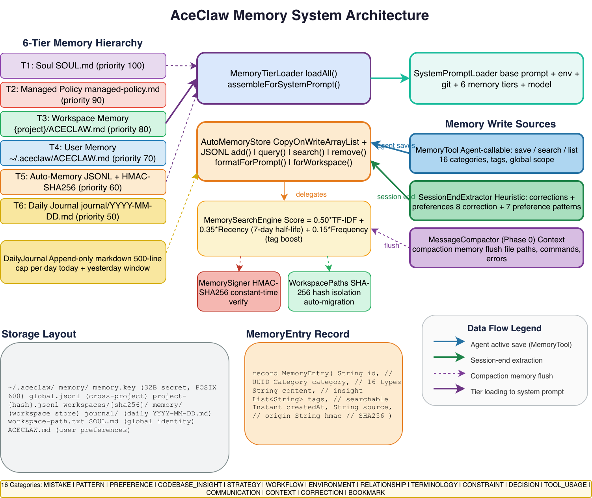

# AceClaw Memory System Design

> Version 1.0 | 2026-02-18

## Architecture Overview



The AceClaw memory system enables **cross-session learning** through a 6-tier hierarchical memory model, HMAC-signed persistent storage, hybrid search, and multiple automated memory extraction pipelines. The agent accumulates knowledge over time — mistakes to avoid, codebase patterns, user preferences — and applies them automatically in future sessions.

---

## 1. Design Principles

| Principle | Description |
|-----------|-------------|
| **Human controls policy, agent controls knowledge** | Tiers 1-4 are human-authored (policy, project rules, preferences). Tier 5-6 are agent-authored (learned insights, activity logs). |
| **Tamper detection, not encryption** | Memories are HMAC-SHA256 signed. Tampered entries are silently skipped on load. Users can inspect JSONL files freely. |
| **Workspace isolation** | Each project gets its own memory directory via SHA-256 hash. No cross-project leakage. |
| **Concise over exhaustive** | System prompt injection is capped. Auto-memory entries are 1-2 sentences. The journal caps at 500 lines/day. |
| **No LLM calls for basic ops** | Memory save, search, load, and session-end extraction are all pure-Java heuristic operations. Only context compaction Phase 2 uses an LLM call. |

---

## 2. 6-Tier Memory Hierarchy

The memory system is organized as a **sealed interface hierarchy** (`MemoryTier`) with 6 tiers loaded in priority order:

```
Priority 100  ┌──────────────────────┐  Immutable core identity
  (highest)   │   T1: Soul           │  SOUL.md
              ├──────────────────────┤
Priority  90  │   T2: Managed Policy │  Organization-managed (enterprise)
              ├──────────────────────┤
Priority  80  │   T3: Workspace      │  {project}/ACECLAW.md
              ├──────────────────────┤
Priority  70  │   T4: User Memory    │  ~/.aceclaw/ACECLAW.md
              ├──────────────────────┤
Priority  60  │   T5: Auto-Memory    │  JSONL + HMAC (agent-written)
              ├──────────────────────┤
Priority  50  │   T6: Daily Journal  │  journal/YYYY-MM-DD.md
  (lowest)    └──────────────────────┘  Append-only activity log
```

### Tier Details

| Tier | Source File | Scope | Author | Loaded |
|------|-----------|-------|--------|--------|
| **Soul** | `SOUL.md` (workspace `.aceclaw/` or global `~/.aceclaw/`) | Identity | Human | Always (if exists) |
| **Managed Policy** | `~/.aceclaw/managed-policy.md` | Organization | IT Admin | Always (if exists) |
| **Workspace Memory** | `{project}/ACECLAW.md` + `{project}/.aceclaw/ACECLAW.md` | Project team | Human | Always (if exists) |
| **User Memory** | `~/.aceclaw/ACECLAW.md` | Personal global | Human | Always (if exists) |
| **Auto-Memory** | `~/.aceclaw/memory/{project-hash}.jsonl` + `global.jsonl` | Per-project | Agent | Always |
| **Daily Journal** | `~/.aceclaw/workspaces/{hash}/memory/journal/YYYY-MM-DD.md` | Per-project | Agent + System | Today + yesterday |

### Implementation: `MemoryTier.java`

```java
public sealed interface MemoryTier {
    String displayName();
    int priority();

    record Soul()            implements MemoryTier { ... }  // priority 100
    record ManagedPolicy()   implements MemoryTier { ... }  // priority 90
    record WorkspaceMemory() implements MemoryTier { ... }  // priority 80
    record UserMemory()      implements MemoryTier { ... }  // priority 70
    record AutoMemory()      implements MemoryTier { ... }  // priority 60
    record Journal()         implements MemoryTier { ... }  // priority 50
}
```

---

## 3. Core Components

### 3.1 AutoMemoryStore

The central memory persistence engine. Thread-safe via `CopyOnWriteArrayList`.

**Key operations:**
- `add(category, content, tags, source, global, projectPath)` — Create, sign, persist, and index a new entry
- `search(query, category, limit)` — Hybrid-ranked retrieval (delegates to `MemorySearchEngine`)
- `query(category, tags, limit)` — Filter-based retrieval (recency-ordered)
- `remove(id, projectPath)` — Delete with file rewrite
- `formatForPrompt(projectPath, maxEntries)` — Format entries grouped by category for system prompt injection
- `forWorkspace(aceclawHome, workspacePath)` — Factory that initializes workspace-scoped store + `DailyJournal`

**Persistence format:** JSONL (one JSON object per line)

```json
{"id":"uuid","category":"MISTAKE","content":"Process.getInputStream() not inputStream()","tags":["java","api"],"createdAt":"2026-02-18T10:30:00Z","source":"tool:memory","hmac":"a3f2..."}
```

### 3.2 MemoryEntry

Immutable Java record with 16 categories:

```java
public record MemoryEntry(
    String id,                // UUID
    Category category,        // 16 enum values
    String content,           // Natural language insight (1-2 sentences)
    List<String> tags,        // Searchable tags (e.g. "gradle", "java")
    Instant createdAt,        // Creation timestamp
    String source,            // Origin (e.g. "tool:memory", "session-end:abc")
    String hmac               // HMAC-SHA256 hex digest
) {
    public String signablePayload() {
        return id + "|" + category + "|" + content + "|" +
               String.join(",", tags) + "|" + createdAt + "|" + source;
    }
}
```

**16 Categories:**

| Category | Purpose | Example |
|----------|---------|---------|
| `MISTAKE` | Bugs/errors to avoid | "Process.getInputStream() not inputStream()" |
| `PATTERN` | Recurring code conventions | "Project uses records for all DTOs" |
| `PREFERENCE` | User's explicit preferences | "Always use Java 21 features" |
| `CODEBASE_INSIGHT` | Structural knowledge | "Auth module is in src/auth/, uses JWT" |
| `STRATEGY` | Approaches that worked/failed | "Run tests after every edit to catch regressions" |
| `WORKFLOW` | Multi-step processes | "Deploy: build -> test -> push -> tag" |
| `ENVIRONMENT` | Environment-specific config | "CI uses JDK 21.0.2 on Ubuntu 22.04" |
| `RELATIONSHIP` | Component/module relationships | "aceclaw-tools depends on aceclaw-memory" |
| `TERMINOLOGY` | Domain abbreviations | "BOM = Bill of Materials (Gradle platform)" |
| `CONSTRAINT` | Explicit limitations | "Never commit files under research/" |
| `DECISION` | Design rationale | "No framework - plain Java for min startup time" |
| `TOOL_USAGE` | Tool quirks/best practices | "Glob max depth is 20, max results 200" |
| `COMMUNICATION` | Communication preferences | "User prefers Chinese for conversations" |
| `CONTEXT` | Carried-forward context | "Working on P2 multi-provider feature" |
| `CORRECTION` | User corrections | "Use ConcurrentHashMap, not HashMap" |
| `BOOKMARK` | Quick references | "Key config file: ~/.aceclaw/config.json" |

### 3.3 MemorySearchEngine

Hybrid ranking combining three signals:

```
Final Score = 0.50 * TF-IDF + 0.35 * Recency + 0.15 * Frequency
```

| Signal | Weight | Algorithm | Purpose |
|--------|--------|-----------|---------|
| **TF-IDF** | 0.50 | `log(1+tf) * log(N/df)` per query token, normalized | Content relevance |
| **Recency** | 0.35 | `2^(-age_days / 7.0)` exponential decay, 7-day half-life | Freshness |
| **Frequency** | 0.15 | `log(1 + matchingTagCount)` | Tag relevance boost |

**Tokenization:** Simple whitespace + punctuation split, lowercase, min 2 chars.

### 3.4 MemorySigner

HMAC-SHA256 signing with per-installation secret key.

- **Key:** 32-byte random secret at `~/.aceclaw/memory/memory.key` (POSIX 600 permissions)
- **Signing:** `HMAC-SHA256(id|category|content|tags|createdAt|source)`
- **Verification:** Constant-time comparison via `MessageDigest.isEqual()` (prevents timing attacks)
- **On tamper:** Entry silently skipped during load, warning logged

### 3.5 WorkspacePaths

Workspace isolation via SHA-256 hashing:

```
Input:  /Users/xinhua.gu/Documents/project/github/Chelava
Hash:   SHA-256 → first 12 hex chars → "a1b2c3d4e5f6"
Output: ~/.aceclaw/workspaces/a1b2c3d4e5f6/memory/
```

- **Marker file:** `workspace-path.txt` records original path for human reference
- **Auto-migration:** Old format (`project-{hashCode}.jsonl`) auto-migrated to new layout on first access

### 3.6 DailyJournal

Append-only daily activity log stored as markdown:

```
~/.aceclaw/workspaces/{hash}/memory/journal/2026-02-18.md
```

- **Format:** `- [2026-02-18T10:30:00Z] Session abc12345 ended: 15 messages, 3 memories extracted`
- **Cap:** 500 lines per file (prevents unbounded growth)
- **Loading window:** Today + yesterday (2-day sliding window injected into system prompt)
- **Writers:** Compaction events, session-end events, turn-level logging

### 3.7 MemoryTierLoader

Central orchestrator that discovers, loads, and assembles all 6 tiers:

```java
// Loading
LoadResult result = MemoryTierLoader.loadAll(aceclawHome, workspacePath, memoryStore, journal);

// Assembly for system prompt
String memorySection = MemoryTierLoader.assembleForSystemPrompt(result, memoryStore, workspacePath, 50);
```

**SOUL.md resolution:** Workspace `.aceclaw/SOUL.md` takes precedence over global `~/.aceclaw/SOUL.md`.

---

## 4. Memory Write Pipelines

There are **three independent pipelines** that write memories:

### 4.1 Agent Active Memory (MemoryTool)

The agent explicitly saves memories during conversations using the built-in `memory` tool.

```
User corrects agent → Agent calls memory tool → save as CORRECTION
Agent discovers pattern → Agent calls memory tool → save as PATTERN
```

**Tool interface:** `memory(action, content, category, tags, query, limit, global)`

| Action | Description |
|--------|-------------|
| `save` | Store a new memory (requires content + category) |
| `search` | Find relevant memories via hybrid search (requires query) |
| `list` | Browse memories, optionally filtered by category |

**System prompt guidance** tells the agent when to save (corrections, patterns, mistakes, preferences, strategies, codebase insights) and when NOT to save (trivial info, every turn, raw file contents).

### 4.2 Session-End Extraction (SessionEndExtractor)

When a session is destroyed, heuristic patterns extract memories from conversation history. **No LLM calls.**

**Extraction patterns:**

| Type | Trigger | Regex Patterns |
|------|---------|---------------|
| **Corrections** | User corrects after assistant message | `^no[,.]\\s`, `should be`, `instead of`, `wrong`, `not X, use Y`, `actually`, `don't use`, `that's incorrect` |
| **Preferences** | User states preferences | `always`, `never`, `prefer`, `don't`, `make sure`, `I like`, `I want` |
| **Modified files** | 3+ file modifications in session | Matches `write_file`, `edit_file` tool results |

**Deduplication:** Content-based HashSet prevents duplicate extractions.
**Truncation:** Content capped at 200 characters.

### 4.3 Context Compaction Memory Flush (MessageCompactor Phase 0)

When the context window hits 85% capacity, the 3-phase compaction process begins. Phase 0 extracts key items before pruning:

| Extracted Item | Source | Example |
|---------------|--------|---------|
| Modified files | `write_file`, `edit_file` tool uses | "Modified file: /src/Foo.java" |
| Bash commands | `bash` tool uses (>10 chars, not cd/ls) | "Executed: ./gradlew clean build" |
| Errors | `ToolResult` with `isError=true` | "Error encountered: NullPointerException..." |

These items flow to the `StreamingAgentHandler` which persists them via `AutoMemoryStore.add()`.

---

## 5. Memory Read Pipeline

### 5.1 System Prompt Injection (Boot Time)

On daemon startup, `SystemPromptLoader` assembles the full system prompt:

```
base prompt (system-prompt.md)
  + environment context (OS, date, JDK, working dir)
  + git context (branch, status, recent commits)
  + 6-tier memory hierarchy (via MemoryTierLoader)
  + model identity (provider, model name)
```

Memory tiers are injected as markdown sections:

```markdown
# Soul (Core Identity)
...

# Project Instructions
...

# Auto-Memory
## Mistakes to Avoid
- Process.getInputStream() not inputStream() [java, api]

## Code Patterns
- Project uses records for all DTOs [java, conventions]

# Daily Journal
- [2026-02-18T08:00:00Z] Session started, 3 files modified
```

### 5.2 Agent-Initiated Search (Runtime)

During a conversation, the agent can search memories using the `memory` tool:

```
Agent encounters unfamiliar error → memory(action="search", query="gradle build error") → ranked results
```

### 5.3 Per-Turn Journal Logging

The `StreamingAgentHandler` appends to the daily journal after each agent turn:

```
- [2026-02-18T10:30:00Z] Turn 3: read_file, edit_file, bash (3 tools, model: claude-3-5-sonnet)
```

---

## 6. Storage Layout

```
~/.aceclaw/
  SOUL.md                              # T1: Core identity (global)
  ACECLAW.md                           # T4: User preferences (global)
  managed-policy.md                    # T2: Organization policy (enterprise)
  memory/
    memory.key                         # 32-byte HMAC secret (POSIX 600)
    global.jsonl                       # Cross-project memories
    project-{hash}.jsonl               # Per-project memories (legacy format)
  workspaces/
    {sha256-12chars}/
      workspace-path.txt               # Human-readable path marker
      memory/
        project.jsonl                  # Per-project memories (new format)
        journal/
          2026-02-17.md                # Yesterday's journal
          2026-02-18.md                # Today's journal

{project}/
  ACECLAW.md                           # T3: Project instructions
  .aceclaw/
    ACECLAW.md                         # T3: Additional project instructions
    SOUL.md                            # T1: Project-specific identity override
    config.json                        # Project config override
```

---

## 7. Security Model

| Threat | Mitigation |
|--------|-----------|
| **Memory tampering** | HMAC-SHA256 signature on every entry. Tampered entries silently skipped. |
| **Timing attack on HMAC** | `MessageDigest.isEqual()` constant-time comparison |
| **Key file exposure** | POSIX 600 permissions (owner read/write only) |
| **Cross-project leakage** | SHA-256 workspace hash isolation. Separate JSONL files per project. |
| **Unbounded growth** | Journal: 500 lines/day cap. Auto-memory: formatted with maxEntries limit. |
| **Injection via memory content** | Memories are plain text, not executable. Loaded into system prompt as markdown. |

---

## 8. AceClaw vs OpenClaw Memory Comparison

### 8.1 Architecture Overview

| Dimension | AceClaw | OpenClaw |
|-----------|---------|----------|
| **Architecture** | 6-tier sealed hierarchy (`MemoryTier`) | Single flat gateway state |
| **Persistence** | JSONL files + HMAC signing | In-memory only (lost on restart) |
| **Cross-session** | Full cross-session learning | No cross-session memory |
| **Workspace isolation** | SHA-256 hash per project | None (single global state) |
| **Memory categories** | 16 typed categories | Untyped key-value pairs |
| **Search** | Hybrid TF-IDF + recency + frequency | None (key lookup only) |

### 8.2 Feature-by-Feature Comparison

| Feature | AceClaw | OpenClaw | Winner |
|---------|---------|----------|--------|
| **Persistent storage** | JSONL files survive daemon restart, OS reboot | In-memory gateway state lost on restart | AceClaw |
| **Memory hierarchy** | 6 tiers (Soul to Journal) with priority ordering | Flat: ClawHub registry + gateway state | AceClaw |
| **Tamper detection** | HMAC-SHA256 per entry, constant-time verify | None | AceClaw |
| **Search/retrieval** | Hybrid ranking (TF-IDF 0.50 + recency 0.35 + frequency 0.15) | Key-based lookup, no ranking | AceClaw |
| **Agent active memory** | Built-in `memory` tool (save/search/list) | No agent memory tool | AceClaw |
| **Session-end extraction** | Heuristic extraction (15 regex patterns, no LLM) | No session-end learning | AceClaw |
| **Context compaction** | 3-phase (flush + prune + summarize) | None | AceClaw |
| **Daily journal** | Append-only per-day markdown, 500-line cap | None | AceClaw |
| **Workspace scoping** | SHA-256 isolated directories per project | None | AceClaw |
| **Category taxonomy** | 16 typed categories (MISTAKE, PATTERN, etc.) | Untyped | AceClaw |
| **Community knowledge** | Not yet (planned P3) | ClawHub: 700+ community skills | OpenClaw |
| **Multi-platform channels** | CLI + daemon (planned: web) | WhatsApp, Telegram, Slack, Discord | OpenClaw |
| **Skill marketplace** | Not yet (planned P3) | ClawHub registry with pull-based updates | OpenClaw |

### 8.3 Memory Lifecycle Comparison

```
                    AceClaw                           OpenClaw
                    ───────                           ────────
  Creation:    3 pipelines:                      Gateway.setState()
               - Agent tool (explicit)            (manual only)
               - Session-end (heuristic)
               - Compaction flush (Phase 0)

  Storage:     JSONL + HMAC-SHA256               In-memory Map
               Per-project + global files         Single flat store

  Retrieval:   Hybrid search engine              Key lookup
               TF-IDF + recency decay            No ranking
               16 categories + tags              Untyped

  Injection:   6-tier system prompt assembly     Manual context
               MemoryTierLoader orchestration    No auto-injection

  Lifecycle:   Persistent (survives restart)     Volatile (lost on restart)
               500-line journal cap              No growth control
               HMAC tamper detection             No integrity checks

  Evolution:   Agent learns across sessions      No cross-session learning
               Pattern/correction detection      Static skill catalog
               Daily journal continuity          No activity tracking
```

### 8.4 Why AceClaw's Approach is Better for Enterprise

1. **Auditability** — Every memory entry is signed, timestamped, and source-tagged. Enterprise compliance teams can inspect `global.jsonl` and verify integrity via HMAC.

2. **Policy layering** — The 6-tier hierarchy lets organizations enforce policies (Tier 2: Managed Policy) that cannot be overridden by project or user memories. OpenClaw has no policy layer.

3. **Workspace isolation** — SHA-256 hashed directories prevent one project's learned knowledge from leaking into another. Critical for consulting firms working on multiple clients.

4. **Deterministic extraction** — Session-end extraction uses regex patterns (no LLM), making it predictable and auditable. OpenClaw has no automated knowledge capture.

5. **Growth control** — Journal caps (500 lines/day), formatted entry limits, and structured categories prevent memory bloat. OpenClaw's in-memory state has no bounds.

### 8.5 Where OpenClaw Excels

1. **Community ecosystem** — ClawHub's 700+ skills provide a marketplace that AceClaw lacks. However, OpenClaw's marketplace has had security issues (credential stealers within 48 hours of going viral).

2. **Multi-channel support** — OpenClaw supports WhatsApp, Telegram, Slack, Discord as first-class channels. AceClaw is CLI-only (web/API planned for P3).

3. **Provider diversity** — OpenClaw's pi-ai SDK supports 20+ providers natively. AceClaw supports 7 providers (Anthropic, OpenAI, Groq, Together, Mistral, Copilot, Ollama) via `LlmClientFactory`.

---

## 9. Class Dependency Graph

```
MemoryTier (sealed interface)
  ├── Soul, ManagedPolicy, WorkspaceMemory, UserMemory, AutoMemory, Journal

MemoryEntry (record)
  └── Category (enum, 16 values)

MemorySigner
  └── HMAC-SHA256 sign/verify

WorkspacePaths
  └── SHA-256 hash, directory resolution, migration

DailyJournal
  └── Append-only markdown, 500-line cap

MemorySearchEngine
  └── Hybrid TF-IDF + recency + frequency ranking

AutoMemoryStore
  ├── uses MemorySigner (sign on add, verify on load)
  ├── uses MemorySearchEngine (hybrid search)
  ├── uses WorkspacePaths (workspace isolation)
  ├── contains DailyJournal (via forWorkspace factory)
  └── stores List<MemoryEntry> (CopyOnWriteArrayList)

MemoryTierLoader
  ├── uses AutoMemoryStore (Tier 5 content)
  ├── uses DailyJournal (Tier 6 content)
  └── produces LoadResult → assembleForSystemPrompt()

--- Daemon layer (consumers) ---

SystemPromptLoader
  └── uses MemoryTierLoader

MemoryTool (aceclaw-tools)
  └── uses AutoMemoryStore

SessionEndExtractor (aceclaw-daemon)
  └── produces entries → AutoMemoryStore.add()

MessageCompactor (aceclaw-core)
  └── Phase 0 extractContextItems → persisted via StreamingAgentHandler
```

---

## 10. Configuration

| Config Key | Default | Description |
|-----------|---------|-------------|
| `contextWindowTokens` | 200,000 | Context window size for compaction trigger |
| `maxTokens` | 16,384 | Max output tokens |
| `thinkingBudget` | 10,240 | Extended thinking budget |
| Compaction threshold | 85% | Trigger compaction at this % of effective window |
| Prune target | 60% | Target after Phase 1 pruning |
| Protected turns | 5 | Recent turns protected from pruning |
| Journal max lines | 500 | Max lines per daily journal file |
| Search default limit | 10 | Default results for memory search |
| List default limit | 20 | Default results for memory list |
| Max limit | 50 | Maximum results for any query |
| Auto-memory max entries | 50 | Max entries injected into system prompt |

---

## 11. Future Roadmap

| Phase | Feature | Status |
|-------|---------|--------|
| P1 | 6-tier hierarchy, HMAC signing, hybrid search | Done |
| P1 | Agent memory tool, session-end extraction, journal | Done |
| P1 | Context compaction with memory flush | Done |
| P2 | CLAUDE.md import system (`@path/to/file`) | Planned |
| P2 | Path-specific conditional rules (`.aceclaw/rules/*.md`) | Planned |
| P2 | Background memory consolidation (merge/prune during idle) | Planned |
| P3 | Skill-based memory (skills remember their own patterns) | Planned |
| P3 | Memory Tool API-level (persistent files like Claude API) | Planned |
| P3 | Community memory marketplace (secured ClawHub-like) | Planned |
