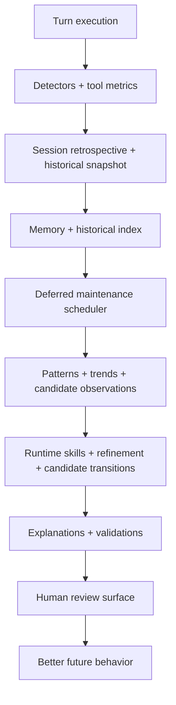
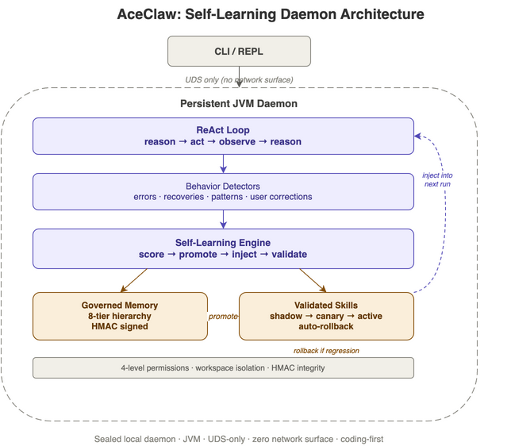
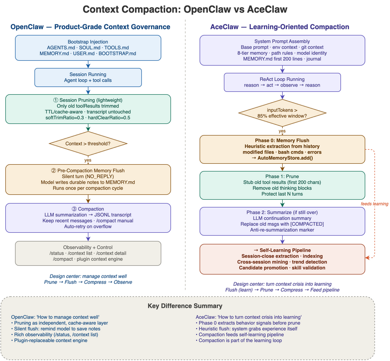

# AceClaw Self-Learning Pipeline

> Version 3.0 | 2026-03-14

## Overview

AceClaw's self-learning system is built around one idea:

> runtime behavior should become reusable knowledge only after it is observed, explained, validated, and governed.

This is why AceClaw is not only a memory system. It is a learning system built into the agent harness itself.

Today the learning loop on `main` already includes:

- turn-time detectors and tool metrics
- session-close retrospectives and historical snapshots
- deferred maintenance for consolidation, mining, and trend detection
- explainability and validation records for adaptive actions
- runtime skill generation and governance
- human review for learned signals

## The Big Picture



The system is designed so that hot-path learning stays cheap, while heavier maintenance runs in the background.

Reference daemon architecture:



## What AceClaw Means By Self-Learning

AceClaw separates three layers of knowledge:

| Layer | Meaning | Example |
|-------|---------|---------|
| **Fact memory** | What should be remembered | a user preference, an important file, a design decision |
| **Behavior memory** | What the agent learned from acting | a failure pattern, a recovery path, a stable tool sequence |
| **Skill memory** | Behavior validated enough to guide execution | a refined skill, a durable draft, a governed runtime workflow |

Most agent systems are strongest on fact memory. AceClaw pushes further into behavior memory, and then tries to turn some of that into governed skill memory.

## Phase 1 And Phase 2

Self-learning on `main` now includes both the original learning loop and the second-phase governance work.

### Phase 1: learn from behavior

- `SessionAnalyzer`
- `HistoricalLogIndex`
- `CrossSessionPatternMiner`
- `TrendDetector`
- `LearningMaintenanceScheduler`
- skill metrics, skill memory feedback, and skill refinement
- runtime dynamic skill generation

### Phase 2: make learning effective and governable

- `LearningExplanationStore` and `LearningExplanationRecorder`
- `LearningValidationStore` and `LearningValidationRecorder`
- `LearningMaintenanceRunStore`
- noise control and aging
- runtime skill governance
- rebuild and recovery hardening
- human review surface

## Current Runtime Flow

The end-to-end flow today looks like this:

1. The agent executes tools and accumulates tool metrics.
2. Per-turn detectors observe failures, recoveries, and repeated sequences.
3. The handler records skill outcomes and post-turn adaptive actions.
4. Session close writes a retrospective summary and a historical session snapshot.
5. `HistoricalLogIndex` appends normalized rows for later mining.
6. `LearningMaintenanceScheduler` runs heavier work on time, session-count, size, idle, or recovery triggers.
7. Maintenance consolidates memory, mines cross-session patterns, detects trends, and bridges useful signals downstream.
8. `DynamicSkillGenerator` can create session-scoped runtime skills from repeated workflows.
9. Explanations, validations, and human reviews make those actions inspectable and governable.

## Core Components

### 1. Turn-Time Learning

The hot path stays mostly heuristic and cheap.

- tool metrics are collected per session
- detector output is converted into typed learning signals
- skill outcomes are tracked for success, failure, rollback, and correction

This layer is meant to notice behavior while the work is still happening.

### 2. Session-Close Learning

Session close is where AceClaw writes down structured experience:

- retrospective summary
- extracted session-level memory
- historical session snapshot
- immediate index updates

This keeps the next session from starting as a blank slate.

### 3. Deferred Maintenance

Maintenance is intentionally deferred so session teardown stays fast.

The current scheduler supports:

- time trigger
- session-count trigger
- size trigger
- idle trigger
- recovery trigger

The background pipeline currently covers:

- `MemoryConsolidator`
- `HistoricalIndexRebuilder`
- `CrossSessionPatternMiner`
- `TrendDetector`
- learning candidate bridging

## Explainability

Every important adaptive action can now leave a structured explanation record.

`LearningExplanation` captures:

- `actionType`
- `targetType`
- `targetId`
- `trigger`
- `summary`
- evidence references

Typical explanation actions include:

- memory writes
- candidate observations and transitions
- runtime skill creation
- runtime skill suppression or expiration
- skill draft creation
- human review application

This means you can now answer:

- why did this runtime skill appear?
- why was this signal suppressed?
- what evidence caused this transition?

## Validation Semantics

AceClaw now records validation decisions for learned behavior instead of treating every adaptive action as equally trustworthy.

`LearningValidation` tracks:

- target type and id
- validation policy
- verdict
- reasons
- evidence

Current verdicts include:

- `OBSERVED_USEFUL`
- `PROVISIONAL`
- `PASS`
- `HOLD`
- `REJECT`
- `ROLLBACK`

This is the layer that turns "the system noticed something" into "the system has a reason to trust or distrust it."

## Runtime Skill Lifecycle

Runtime skills are the clearest example of behavior becoming reusable knowledge.

The current lifecycle is:

1. detect repeated non-bash workflow
2. generate a session-scoped runtime skill
3. record explanation + validation
4. observe runtime success, failure, or user correction
5. suppress, expire, or keep the runtime skill
6. only allow durable draft promotion after enough useful evidence

This keeps runtime adaptation fast, but still governed.

## Human Review Surface

Operators can now inspect and review learned signals from the CLI.

Available commands:

```text
/learning
/learning signals
/learning reviews
/learning review <action> <targetType> <targetId> [note]
```

Current review actions:

- `useful`
- `pin`
- `suppress`
- `low_value`
- `incorrect`
- `unsuppress`
- `unpin`

Human review is written back into:

- explanation history
- validation history
- durable review records

So review is not only a note. It becomes part of the learning system itself.

## Recovery And Rebuild Hardening

Learning data is no longer treated as best-effort only.

The current code now hardens:

- stale historical index rebuild
- partial write safety for session snapshots
- corrupted snapshot tolerance
- maintenance interruption recovery
- restart-time recovery pickup
- per-workspace rebuild consistency

This matters because a self-learning system is only useful if it can survive interruption without silently forgetting what it learned.

## Heuristics vs LLM Calls

AceClaw keeps most learning logic deterministic.

### Pure Java / heuristic path

- save and search memory
- session-close extraction
- historical indexing
- consolidation
- pattern mining
- trend detection
- rebuild and recovery
- review storage and learning summaries

### LLM-assisted path

- context compaction
- skill refinement
- runtime skill drafting

The goal is simple: use heuristics for cheap, auditable signal handling; use LLM calls only where synthesis is worth the cost.

## AceClaw vs OpenClaw

OpenClaw is a helpful contrast.

OpenClaw is strong at explicit memory, gateway orchestration, and operational context management. AceClaw starts from a different question: how does behavior become reusable knowledge?

That leads to a different emphasis:

| Topic | OpenClaw-style default | AceClaw default |
|-------|------------------------|-----------------|
| Main concern | context and retrieval | behavior and adaptation |
| What gets persisted first | notes and gateway state | explanations, validations, and governed signals |
| What changes the next run | better context injection | better context injection plus adaptive behavior |
| Operator tool | inspect context | inspect and review learned signals |

The original comparison diagrams used during this work are checked into:

- [`img/learning/openclaw_gateway_architecture.png`](img/learning/openclaw_gateway_architecture.png)
- [`img/learning/aceclaw_daemon_architecture.png`](img/learning/aceclaw_daemon_architecture.png)
- [`img/learning/context_compaction_openclaw_vs_aceclaw.png`](img/learning/context_compaction_openclaw_vs_aceclaw.png)

Comparison reference:



## What To Measure Next

Now that the full mechanism is in `main`, the next question is effectiveness.

Useful metrics include:

- signal-to-action latency
- runtime skill hit rate
- runtime skill success rate
- refinement success delta
- suppress / incorrect review rate
- conversion from learned signal to durable behavior

That is how AceClaw moves from "active learning" to "effective learning."
